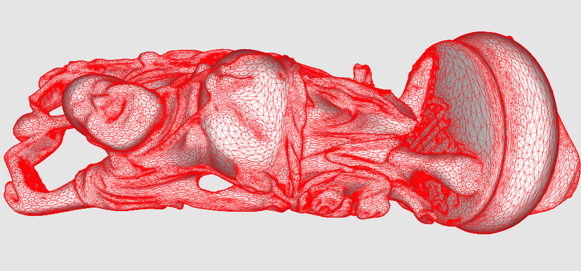

# vpreduce (<small>V-PolygonReducer app</small>)

## Overview
vpreduceは、Wavefront OBJ形式のポリゴンデータを読み込み、ポリゴンリダクションを行うプログラムです。

vpreduceはC++で記述され、[wxWidgets](https://www.wxwidgets.org)と[OpenGL](https://www.opengl.org)を使用しています。

また、ポリゴンリダクション機能は[Michael Garland](https://mgarland.org)氏が開発した[QSlim](https://mgarland.org/software/qslim.html)を、
理化学研究所/VCADシステム研究会で開発された[V-Xgen](http://vcad-hpsv.riken.jp/jp/release_software/V-Xgen/)に含まれるポリゴンリダクションモジュールインターフェース(vpr_qslim)を介して使用しています。

---

## Pre-Compiled binary
bin/ 配下に、コンパイル済みの実行ファイルが含まれます。
- bin/Windows/vpreduce.exe  (Windows10 64bit)
- bin/macOS/vpreduce.app  (macOS 10.15)
- bin/Ubuntu18/vpreduce  (Ubuntu 18.04 64bit)
- bin/CentOS7/vpreduce  (CentOS 7.6 64bit)

これらの実行ファイルは、任意のディレクトリにコピーして使用できますが、その際には実行ファイルと同じディレクトリにあるvpr_qslimモジュールも一緒にコピーしてください。

---

## Operation
<dl>
<dt>Open OBJ file</dt>
<dd>FileメニューからOpenを選択すると表示されるファイル選択ダイアログでOBJファイルを選択します。</dd>
<dt>View control</dt>
<dd>マウス左ボタンドラッグで回転、Shift+マウス左ボタンドラッグで平行移動、Ctrl(macOSではCommand)+マウス左ボタン上下ドラッグで拡大・縮小します。マウスホイール回転でも拡大・縮小します。
また、Viewメニューから「Reset View」を選択するか、Spaceバーを押すと初期状態に戻ります。</dd>
<dt>Polygon Reduction</dt>
<dd>ウインドウ下部の「Faces(%)」欄に、オリジナルに対して何%まで削減するかを入力します。また、「#of Faces」欄に直接ポリゴン数で指定することもできます。
いずれの場合も、指定した規模までポリゴンリダクションが行われた状態のモデルがウインドウに3D表示されます。
</dd>
<dt>Save OBJ file</dt>
<dd>FileメニューからSaveを選択すると表示されるファイル選択ダイアログで指定したOBJファイルに、現在のポリゴン数の状態のモデルを保存します。</dd>
<dt>Quit</dt>
<dd>FileメニューからQuitを選択するか、Escキーを押すとプログラムを終了します。</dd>
</dl>

---

## Sample
HappyBuddha(Stanford) original model (600,000 faces)


95% reduced model (30,000 faces)


---

## Build from source
### Qslim
事前にQSlimのビルドが必要です。

本リポジトリでは、Michael Garland氏が公開している[オリジナルのQSlim](https://mgarland.org/software/qslim.html)を、[Alec Jacobsob氏がMacOS X用にポーティングしたもの](https://github.com/alecjacobson/qslim)をサブモジュールとして参照しています。以下のように行うことで、こちらも含めてリポジトリのクローンを行うことができます。
```
 $ git clone --recursive https://github.com/yoshikawa-hiroyuki/vpr.git
```
この場合は、vpr/qslim/ 配下にQSlimのソースが展開されるので
、README.mdの記述を参考にビルドを行います。

QSlimのビルドには、[FLTK](https://www.fltk.org/)がインストールされている必要があります。事前にインストールを行ってください。
以下では、FLTKが`/usr/local`配下にインストールされているものとします。
```bash
$ cd libgfx
$ env CPPFLAGS="-I/usr/local/include -fpermissive -fPIC" LDFLAGS="-L/usr/local/lib" ./configure
$ make -C src
$ cd ../mixkit
$ ./configure
$ make -C src
```


### vpr_qslim
#### Linux
```
$ cd vpr_qslim
$ make -f Makefile.Linux
$ cp vpr_qslim.so ../vpr_app/
```

#### macOS
```
$ cd vpr_qslim
$ make -f Makefile.OSX
$ cp vpr_qslim.dylib ../vpr_app/
```

#### Windows
vpr_qslimに移動し、`vpr_qslim.sln`をVisual Studio 2019 C++で開き、x64|Releaseのビルドを行います。その後、以下のコマンドを実行します。
```
> copy x64\Release\vpr_qslim.dll ..\vpr_app
```

### vpr_app

vpreduceのビルドはvpr_appディレクトリで行います。

vpreduceのビルドには、wxWidgets-3.xが必要です。事前にインストールを行ってください。

#### Linux
```
$ cd vpr_app
$ make -f Makefile.Linux
```

#### macOS
```
$ cd vpr_app
$ make -f Makefile.OSX
```

#### Windows
```
> cd vpr_app
> nmake /f MAKEFILE.WIN64
```

---

### Author
_YOSHIKAWA Hiroyuki, FUJITSU LTD._
